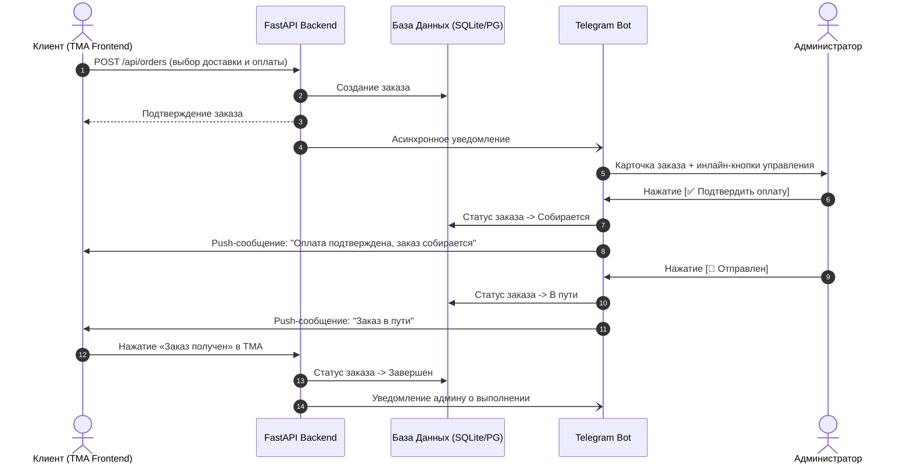

# 🛍 Telegram Mini App (TMA) Online Store

Современный, высокопроизводительный интернет-магазин в формате **Telegram Mini App (TMA)** с панелью управления товарами через **Google Sheets**, встроенным **Telegram-ботом на aiogram 3.x** и асинхронным **FastAPI** бэкендом.

---

## 🌟 Возможности и архитектура

- **🚀 Backend:** Python (FastAPI), SQLAlchemy 2.0 AsyncIO (SQLite / PostgreSQL), Pydantic v2.
- **🤖 Telegram Bot (aiogram 3.x):** 
  - Запуск Mini App по кнопке в чате и в постоянном меню.
  - Мгновенные уведомления администратору о новых заказах с интерактивными инлайн-кнопками (`[✅ Подтвердить оплату]`, `[🚚 Отправлен]`, `[🎉 Выполнен]`, `[❌ Отклонить]`).
  - Автоматические push-уведомления клиентам об изменении статуса их заказа.
- **📊 Google Sheets Panel:** Управление каталогом товаров прямо из таблицы (ID, Название, Описание, Цена, Ссылки на фото, Наличие/Статус) с автоматической периодической синхронизацией и быстрым кэшированием в БД.
- **📱 Frontend SPA:** 
  - Светлая эстетичная тема (Pure White `#FFFFFF` + Slate `#F8FAFC` + Emerald `#10B981`).
  - Адаптация под экраны смартфонов с поддержкой `safe-area-insets`.
  - Тактильный отклик Telegram HapticFeedback при кликах и копировании.
  - Каталог с живым поиском и фильтрацией по наличию.
  - Карточка товара с галереей/слайдером фото.
  - Checkout с выбором получения (**Самовывоз** с адресом и правилами / **Доставка** СДЭК и Почта России) и способов оплаты (**СБП**, **Криптовалюта** USDT TON / USDT TRC20 / TON, **Наличные** при самовывозе).
  - Раздел «Мои заказы» с отслеживанием статусов в реальном времени и кнопкой **«Заказ получен»** для клиента.

---

## 📁 Структура проекта

```text
├── run.py                           # Скрипт запуска сервера
├── test_e2e.py                      # Сквозной интеграционный тест-сьют
├── requirements.txt                 # Зависимости проекта
├── .env.example                     # Шаблон переменных окружения
├── .env                             # Конфигурация приложения
├── credentials/                     # Сервисный ключ Google Cloud (JSON)
│   ├── google_service_account.json
│   └── google_service_account_sample.json
├── backend/
│   └── app/
│       ├── main.py                  # Точка входа FastAPI, CORS, lifespan
│       ├── config.py                # Pydantic Settings
│       ├── database.py              # Асинхронное подключение SQLAlchemy
│       ├── models/                  # Модели БД (User, Product, Order)
│       ├── schemas/                 # Pydantic-схемы
│       ├── api/                     # REST API (products, orders, store, sync)
│       ├── bot/                     # Модуль Telegram-бота (aiogram 3.x)
│       └── services/                # Бизнес-логика (Google Sheets sync, Orders)
└── frontend/                        # Клиентская часть (Telegram Mini App SPA)
    ├── index.html                   # Разметка с Tailwind CSS и Telegram WebApp SDK
    ├── css/styles.css               # Стили, safe-areas, анимации
    └── js/                          # Модули JS (app, telegram, api, components)
```

---

## 🚀 Быстрый старт

### 1. Клонирование и установка зависимостей

```bash
# 1. Установите зависимости
pip install -r requirements.txt
```

### 2. Настройка переменных окружения

Скопируйте шаблон `.env.example` в `.env` и укажите свои параметры:

```bash
cp .env.example .env
```

Основные переменные:
- `BOT_TOKEN`: Токен вашего бота от `@BotFather`.
- `ADMIN_CHAT_ID`: Ваш числовой Telegram ID (можно узнать у бота `@userinfobot`).
- `WEBAPP_URL`: HTTPS-адрес вашего развернутого приложения (для локальной разработки можно использовать `https://...ngrok-free.app` или `http://localhost:8000`).
- `GOOGLE_SERVICE_ACCOUNT_FILE`: Путь к JSON ключу Google (по умолчанию `credentials/google_service_account.json`).
- `GOOGLE_SPREADSHEET_ID`: ID вашей Google Таблицы.

### 3. Запуск интеграционных тестов

Перед запуском вы можете выполнить полный E2E-тест:

```bash
python test_e2e.py
```

### 4. Запуск сервера и бота

```bash
python run.py
```

После запуска:
- **Telegram Mini App:** [http://localhost:8000/](http://localhost:8000/)
- **Интерактивная документация Swagger API:** [http://localhost:8000/docs](http://localhost:8000/docs)
- **Telegram-бот:** автоматически запустится в фоне и будет готов принимать команды `/start`.

---

## 📑 Настройка Google Sheets (Панель товаров)

1. **Создайте проект в Google Cloud Console:**
   - Перейдите в [Google Cloud Console](https://console.cloud.google.com/).
   - Включите **Google Sheets API** и **Google Drive API**.
2. **Создайте сервисный аккаунт:**
   - Раздел *IAM & Admin* ➔ *Service Accounts* ➔ *Create Service Account*.
   - Создайте ключ в формате **JSON** (*Keys* ➔ *Add Key* ➔ *Create new key* ➔ *JSON*).
   - Сохраните скачанный файл в папку `credentials/google_service_account.json`.
3. **Создайте Google Таблицу:**
   - Создайте новую Google Таблицу и назовите лист `Товары` (или как указано в `GOOGLE_SHEET_NAME`).
   - Предоставьте доступ сервисному аккаунту: нажмите кнопку **«Поделиться»** (Share) в таблице и добавьте `client_email` сервисного аккаунта (с правами Читатель или Редактор).
   - Скопируйте ID таблицы из URL (`https://docs.google.com/spreadsheets/d/{SPREADSHEET_ID}/edit`) и вставьте в `.env` (`GOOGLE_SPREADSHEET_ID`).

### Формат колонок в Google Таблице:

| ID | Название | Описание | Цена | Ссылки на фото через запятую | Наличие/Статус |
| :--- | :--- | :--- | :--- | :--- | :--- |
| SKU-001 | Наушники Pro Max | Премиальные беспроводные наушники | 14990 | https://img.site/1.jpg, https://img.site/2.jpg | В наличии |
| SKU-002 | Смарт-часы Ultra | Корпус из титана, OLED дисплей | 27900 | https://img.site/watch.jpg | В наличии |

> 💡 **Автономный режим:** Если сервисный аккаунт еще не подключен, приложение автоматически наполнит базу данных демонстрационными товарами высокого качества, чтобы магазин работал прямо из коробки!

---

## 🤖 Настройка Telegram Бота и Mini App

1. Откройте диалог с **@BotFather** в Telegram.
2. Создайте бота командой `/newbot` и скопируйте полученный токен в `BOT_TOKEN`.
3. Настройте кнопку меню Mini App:
   - Отправьте команду `/mybots` ➔ выберите вашего бота ➔ *Bot Settings* ➔ *Menu Button* ➔ *Configure menu button*.
   - Введите HTTPS URL вашего WebApp (например, через Ngrok или боевой домен).
4. Укажите ваш Telegram ID в `ADMIN_CHAT_ID`, чтобы получать карточки заказов и управлять ими с помощью инлайн-кнопок.

---

## 💳 Логика работы заказов и оплат



---

## 🛡 Безопасность

- Все запросы от Mini App к API проходят криптографическую валидацию подписи **HMAC-SHA256** с использованием токена бота (`verify_telegram_init_data`).
- Подделка `telegram_id` или данных профиля невозможна.
- Доступ к просмотру заказов строго ограничен владельцем заказа и администратором.

---

## 🚢 Деплой на продакшн (Production)

### Вариант 1: Запуск через Systemd + Uvicorn

```ini
[Unit]
Description=Telegram Mini App Shop
After=network.target

[Service]
User=root
WorkingDirectory=/var/www/telegram-shop
ExecStart=/var/www/telegram-shop/venv/bin/python run.py
Restart=always
RestartSec=5
EnvironmentFile=/var/www/telegram-shop/.env

[Install]
WantedBy=multi-user.target
```

### Вариант 2: Nginx Reverse Proxy (SSL)

```nginx
server {
    server_name shop.yourdomain.com;

    location / {
        proxy_pass http://127.0.0.1:8000;
        proxy_http_version 1.1;
        proxy_set_header Upgrade $http_upgrade;
        proxy_set_header Connection "upgrade";
        proxy_set_header Host $host;
        proxy_set_header X-Real-IP $remote_addr;
        proxy_set_header X-Forwarded-For $proxy_add_x_forwarded_for;
        proxy_set_header X-Forwarded-Proto $scheme;
    }
}
```
